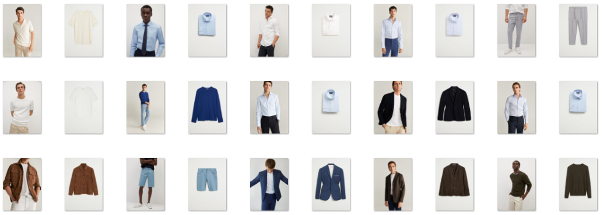

# Datathon FME 2024: Determining design attributes of clothes

Code for the MANGO challenge at the Datathon FME 2024 that ranked 2nd in the Kaggle leaderboard.

The models are trained in `main.ipynb` and the `GUI.py` runs a streamlit app to make inference on new items.

[streamlit-GUI.webm](https://github.com/user-attachments/assets/7e84b218-9951-4ffa-b806-93a14b6ea40f)
